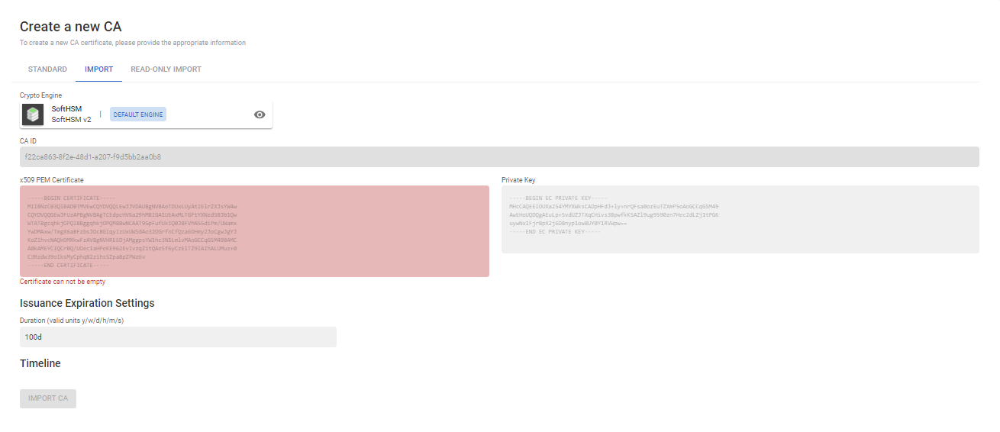

# PKI Admin Setup

Before jumping any further, please check out the [installation process](/setup)
to deploy all Lamassu services. This section will guide you through the basic
functionalities provided by our PKI to start provisioning your devices.

## Certification Authorities

The first step to provision your devices with digital certificates is to create
the Certification Authority. The role of a CA is to issue and manage all the
certificates.

There are three possibilities to create a new CA:

  - Create a new CA from scratch
  - Bring your own external CA
  - Import third-party external CA

### Create a new CA from scratch
=== "Web Console"

    To create a new CA, fill the form taking into account the following considerations:

      **CA Settings**:
      - Lamassu supports the use of several cryptographic engines, therefore, when creating the CA you can choose which cryptographic engine to use to store the private key.
      - Lamassu supports both `RSA` and `EC` based CAs. But the configured Crypto Engine may or may not support both algorithms. Check out also the supported key sizes for each algorithm family as it is also dependant on the configured engine.

      **CA Expiration Settings** and **Issuance Expiration Settings**:

      - The CA expiration time must be greater than the lifespan of the issued certs.
      - There are 3 types of expiration formats, choose one:

        - `Duration`: Uses a relative *time delta* to determine the expiration date. The time delta can be specified in seconds (s), minutes (m), hours (h), days (d), weeks (w) or in years (y). Example: `10y` equals to 10 years. 
        - `End Date`: Set a specific date for expiration in ISO 8601 format.
        - `Indefinite Validity`: The expiration is fixed to the following timestamp `99991231235959Z` (31/12/9999 at 23:59:59).
    <figure markdown>
      
      <figcaption>Create CA from scratch</figcaption>
    </figure>

=== "API Rest"
    *TODO*

=== "Golang SDK"
    *TODO*

### Bring your own external CA

=== "Web Console"

    To import an external CA, fill the form with the following considerations:

      **CA Settings**:

      - The configured Crypto Engine may or may not support importing external CAs.
      - Select the corresponding crypto engine
      - The CA name **MUST** be unique.
      - Import x509 PEM Certificate and Private Key in PEM Format

      **Issuance Expiration Settings**:
      - The CA expiration time must be greater than the lifespan of the issued certs.
      - `Duration`: Uses a relative *time delta* to determine the expiration date.
    <figure markdown>
      
      <figcaption>Import CA from scratch</figcaption>
    </figure>
=== "API Rest"
    *TODO*

=== "Golang SDK"
    *TODO*

### Import third-party external CA

=== "Web Console"

    To import an third-party external CA, fill the form with the following considerations:

      **CA Settings**:
      - The CA name **MUST** be unique.
      - Import x509 PEM Certificate

    <figure markdown>
      
      <figcaption>Import third-party CA from scratch</figcaption>
    </figure>
=== "API Rest"
    *TODO*

=== "Golang SDK"
    *TODO*

### Device Manufacturing Systems

The second step before provisioning the devices is to create a DMS. The DMS is responsible for issuing and managing digital certificates.

=== "Web Console"

    To create a DMS, I filled in the form with the following considerations:

      **DMS Definition**:

      - The DMS name **MUST** be unique.
      - Deployment Mode **MUST** be Hosted by Lamassu
    <figure markdown>
      
      <figcaption>DMS Definition</figcaption>
    </figure>

      **Enroll Device Registration**:

      - Registration Mode can be of two types:
        - JITP: All devices are provisioned, i.e. those that are registered and those that are not.
        - Enforce Pre Registration: Only pre-registered devices are provisioned.
      - Choose the Icon the device is to have
      - Tags associated with the device
    <figure markdown>
      
      <figcaption>Enroll Device Registration</figcaption>
    </figure>

      **Enrollment Settings**:

      - The protocol used for the enrolment process is EST and the authentication is MutualTLS.
      - Select the CA through which the certificates are to be issued
      - Select the validation CAs to authorise device enrolment.
      - In case you want to enroll devices that are already provisioned, select the **Allow Override Enrollment** variable.
      - The **Chain Validation Level** is explained in the [provisioning flows](usage-flows.md) section.
    <figure markdown>
      
      <figcaption>Enrollment Settings</figcaption>
    </figure>

      **Reenrollment Settings**:

      - If you want to allow the reenrollment of devices with expired certificate, you have to activate the flag **Allow Expired Renewal**.
      - Configure the period from which certificate renewal is to be allowed
      - Select additional CAs to validate/authorise device reenrollment.
    <figure markdown>
      
      <figcaption>Reenrollment Settings</figcaption>
    </figure>

      **CA distribution**:

      - Select the certificates of the CAs to be sent via the CACerts endpoint.
    <figure markdown>
      
      <figcaption>CA distribution</figcaption>
    </figure>

      **AWS IoT Settings**:

      - Select the type of shadow to be created on the device, **Classic Shadow** or **Named Shadow**.
    <figure markdown>
      
      <figcaption>AWS IoT Settings</figcaption>
    </figure>

=== "API Rest"
    *TODO*

=== "Golang SDK"
    *TODO*