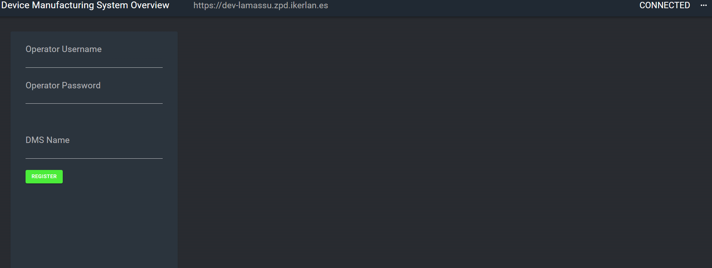
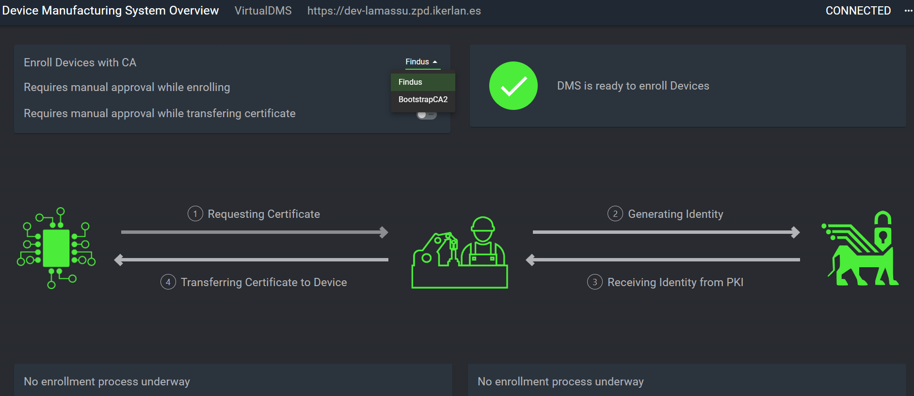
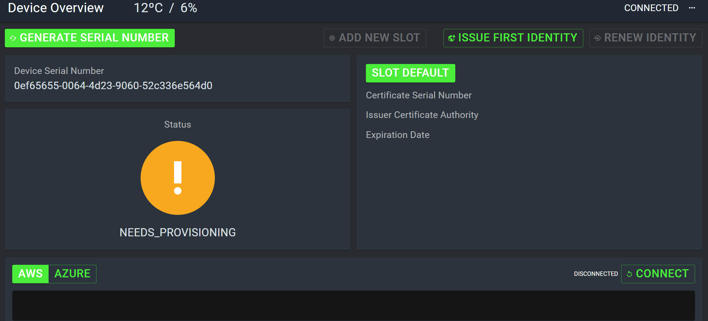

# Lamassu Simulation Tools

It is recommended to follow this directory layout when deploying different Lamassu tools:
    ```
    $HOME/
         ├── lamassu-compose
         ├── lamassu-simulation-tools
    ```

1. Clone the repository and get into the directory: 
    ```
    git clone https://github.com/lamassuiot/lamassu-simulation-tools.git 
    cd lamassu-simulation-tools
    ```

2. Basic configuration:
    ```
    export DOMAIN=dev.lamassu.io
    export LAMASSU_GATEWAY=https://${DOMAIN}
    export AWS_IOT_ENDPOINT=
    export AZURE_IOT_HUB_ENDPOINT=
    export AZURE_DPS_ENDPOINT=
    export AZURE_SCOPE_ID=
    envsubst < .env | tee .env  > /dev/null
    ```

3. Run the VDMS and VDevice applications:
    ```
    docker-compose up -d
    ```
## Virtual DMS

When deploying the docker container with the virtual DMS, the DMS is accessible at <http://dev.lamassu.io:7002>.

When accessing the Web interface, it is necessary to enter both the access credentials for the Operator user and the name of the DMS to be created.

- **Operator Username**: operator
- **Operator Password**: operator
- **DMS Name**: VirtualDMS

When pressing the **Register** button the administrator has to approve the DMS, until the DMS is approved the VDMS cannot be used.



1. **Admin** - Authenticate the admin user
  ```
  ENROLLER_USERNAME=enroller
  ENROLLER_PASSWORD=enroller
  DOMAIN=dev.lamassu.io
  ```
  ```
  ENROLLER_TOKEN=$(curl -k -s --location --request POST "https://auth.$DOMAIN/auth/realms/lamassu/protocol/openid-connect/token" --header 'Content-Type: application/x-www-form-urlencoded' --data-urlencode 'grant_type=password' --data-urlencode 'client_id=frontend' --data-urlencode "username=$ENROLLER_USERNAME" --data-urlencode "password=$ENROLLER_PASSWORD" | jq -r .access_token)
  ```

2. **Admin** - Authorize the enrollment with all the provisioned CAs
  ```
  export DMS_NAME=VirtualDMS
  ```
  ```
  AUTHORIZED_CAS=$(curl -k "https://$DOMAIN/api/ca/v1/pki" --header "Authorization: Bearer $ENROLLER_TOKEN" | jq .cas[].name | jq -s)
  ```
  ```
  curl -k --location --request PUT "https://$DOMAIN/api/dmsmanager/v1/$DMS_NAME/status" \
  --header "Authorization: Bearer $ENROLLER_TOKEN" \
  --data-raw "{\"status\":\"APPROVED\"}"
  ```
  ```
  curl -k --location --request PUT "https://$DOMAIN/api/dmsmanager/v1/$DMS_NAME/auth" \
  --header "Authorization: Bearer $ENROLLER_TOKEN" \
  --data-raw "{\"authorized_cas\":$AUTHORIZED_CAS}"
  ```

Once approved, the DMS is operational and waiting for requests from the devices. In the Web interface you can select the CA through which you want to sign the device certificates **Enroll Devices with CA**.




When a request is received from a device the operator must approve the request and forward the request to Lamassu. Once Lamassu has issued the certificate, the same operator must transfer the certificate to the device. For this purpose, when a request is received in the Virtual DMS, the information of the request and a button to authorize the request appear in the Virtual DMS. On the other hand, when Lamassu issues the certificate, the message with the information of the certificate and a button to transfer the certificate to the device also appear in the Virtual DMS.


## Virtual Device

When deploying the docker container with the virtual DMS, the DMS is accessible at <http://dev.lamassu.io:7001>.



When accessing the Virtual Device Web interface for the first time, only the **ISSUE FIRST IDENTITY** option appears as available, this button is used to request a certificate from the device. This request is sent to the DMS and if the request is approved an identity is generated for the device. Once an identity is generated in the Web interface you can see the most relevant information, **Certificate Serial Number**, **Issuer Certificate Authority** and **Expiration Date**.


When a device has a valid identity and its status is **PROVISIONED** the identity can be renewed using the **RENEW IDENTITY** button, i.e. requesting a new certificate. This is usually done when the active identity is about to expire.

On the other hand, in case you want to register a new device using the **GENERATE SERIAL NUMBER** button you can generate a new serial number simulating a new device. To register it, press the **ISSUE FIRTS IDENTITY** button as explained in the previous steps.

