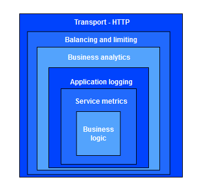

# Tests

Integration test are carried out to check the proper functionabillity of the server. The tests, start up the same server used in production with an empty database and run against the server using HTTP.

To create the test, _httpexpect_ library has been used; a set of chainable builders for HTTP requests and assertions for HTTP responses and payload, on top of net/http and several utility packages.

Each test-case has three arguments: the name of the test, an instance of the service and a _httpexpect.Expect_ object, upon which the rest call will be made.

Passing an instance of the service per test, allows custom inicialization of the database per test. Also, as the service used is the exact same used in production, the calls made from one service to another are mantained, allowing to check the interoperability from services.

The response obtained from the _httpexpect.Expect_ object will be evaluated; the response's keys and values will be revised to compare with the expected ones. If the expected results don´t match with the obtained ones, an error will occur, allowing the developers to notice and fix it before releasing it into production.

Three different branches are differenciated:

- Development: this branch is used for testing purposes whenever a service is modified to check the proper functionabillity of the same service.
- Release: this branch is used for testing purposes whenever a service is modified to check the proper functionabillity of the all services.
- Main: once the test are passed successfully, changes are published in _main_ branch.

## Coverage

The following commands can be used to calculate the coverage of the system:

```
go test -json -v ./pkg/... -cover  -coverprofile=coverage.out -coverpkg=./...
go tool cover -html=coverage.out -o coverage.html

go tool cover -func coverage.out | grep total | awk '{print substr($3, 1, length($3)-1)}' | .github/coverage-badge.sh
go tool cover -func coverage.out | grep total
```

The total and relative percentages of each component can be found in the resulting _cover.html_ file. Opening the file in the browser, will mark the tested code in green and the untested one in red.

The resulting _cover.out_ file, can be imported to _go-cover-treemap.io_ webpage to generate a visual representation of the coverage results:

<figure markdown="1">

</figure>

### Pipeline

The test are run against the server using HTTP, the top layer of the system. Facilitating the task of testing the layers below.

<figure markdown="1">

</figure>
