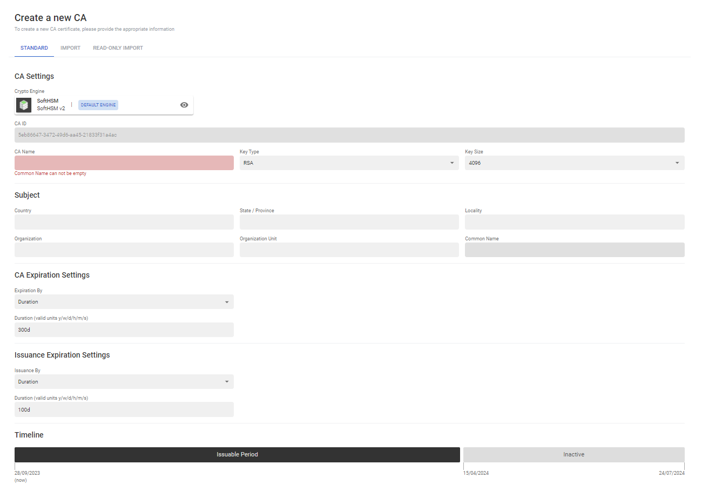

# Lamassu UI

The UI is an easy manageable tool designed to ease the burdens to non-technical users in using Lamassu PKI.


## Filtering, Sorting and Pagination

Lamassu API supports filtering, sorting and pagination.

The filter can be form by the following parameters, being each of them optional:

- `filter= attribute[operator]=value`
- `sort_by=attribute.[asc|desc]`
- `limit=value` . Limits the maximun number of results of the query
- `offset=value` . In addition to `limit`, implements pagination. It defines the index of the first value from the resulting query.

!!! Example
       

    ```
     /v1/devices?filter=id[contains]=device_id&sort_by=id.asc&limit=100&offset=15

     /v1?filter=id[contains]=dms_id&sort_by=id.desc
    ```

### Operators

Depending of the data type of the parameters, the supported operators will vary.

- Strings : `equals`, `notequals`, `contains`, `notcontains`
- Dates: `before`, `after`, `is`, `isnot`
- Enums: `is`, `isnot`
- Numbers: `lessthan`, `greaterthan`, `lessorequal`, `gretaerorequal`, `equal`, `notequal`


## Create a new Certification Authority

There are two methos of creating a new CA from the UI.

The first one, filling the following form taking into account the following things:

- Lamassu supports both `RSA` and `EC` based CAs.
- The CA name MUST be unique.
- The CA expiration time must be greater than the lifespan of the issued certs.


 

The other one, will be importing it. A Certificate and a Private Key will be required.

 


## Registration of a DMS using the UI

Using the UI, creating a new DMS is as simple as filling the following form. 


Once the DMS has been created successfully, a prompt showing the generated private key will be shown. It is encouraged to download it just after the creation as this prompt will be shown only once.


The status of the new created DMS will be `Pending Approval`, to approve it, we must select at least one CA from the list of registered CAs. The selected CAs will be the authorised ones to sign certificates from now on. 


## Registration of a device using the UI


To create a device, we will need to fill the following form taking into account:

- A device identification must be provided.
- A DMS must be assigned.


Each device can have certificates signed by different authorised CAs.


The certificates of each device as well as the cloud-connectors will be showned.

