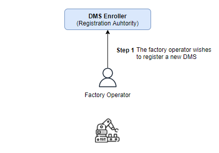
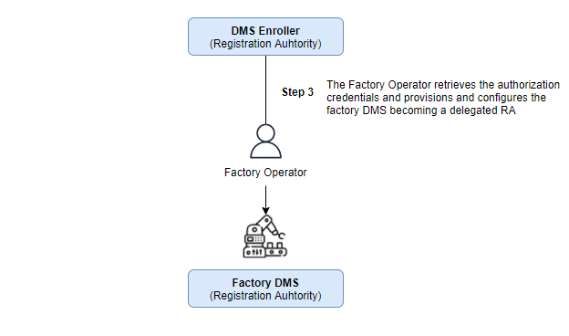
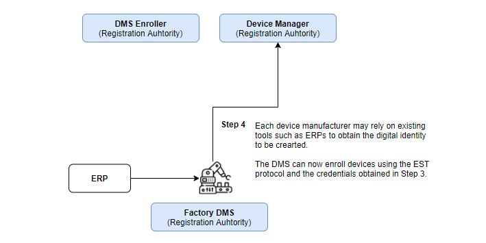
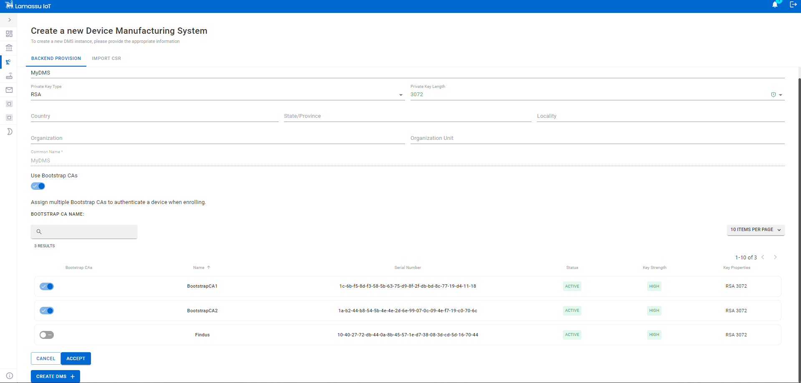

# Getting Started

Before jumping any further, please check out the [installation process](/setup) to deploy all Lamassu services. This section will guide you through the basic functionalities provided by our PKI to start provisioning your devices.

## Overview

### Create a new Certification Authority

The first step to provision your devices with digital certificates is to create the Certification Authority. The role of a CA is to issue and manage all the certificates. To create a new CA, fill the following form taking into account the following things:

- Lamassu supports both `RSA` and `EC` based CAs.
- The CA name MUST be unique.
- The CA expiration time must be greater than the lifespan of the issued certs.


 

### Register a new Device Manufacturing System

Lamassu is a PKI designed for the industrial and IoT sector. To better integrate this PKI in real life manufacturing system, Lamassu delegates the issuance of device certificate to the factory itself. First lets dive into the Device Manufacturing System *(DMS for short)* registration step by step. After that, a couple of examples will demonstrate how to start enrolling your devices using the [Lamassu's Virtual DMS software](https://github.com/lamassuiot/lamassu-virtual-dms) as well as using the UI.

Device manufacturing process tend to be highly automated. Provisioning the devices with digital identities should not slow down the fabrication process. Lamassu addresses this challenge introducing the DMS concept as core.

One of the factories operators stars the process by generating a DMS registration request contained in a Certificate Signing Request also referred as CSR. This CSR is then sent to the DMS Enroller service to be approved by one of the PKI Administrators:
<figure markdown>
  
</figure>

The Administrator then decides if the request is approved or denied. If it decision is to approve the DMS registration request, the Administrator must specify which CAs will that particular DSM be entitled to issue certificates with:

<figure markdown>
  
</figure>

Once, and only if, the DMS registration request is approved, then the Operator must retrieve the signed CSR and pass it to the DMS software that will be in charge off requesting the issuance of new digital certificates for the manufactured devices:

<figure markdown>
  
</figure>

Finally, the DMS is able to request new x509 certificates for its manufactured devices. The DMS may be assisted by additional tools to obtain the manufactured device unique identifier. 
<figure markdown>
  
</figure>

!!! note
    Envoy is used as an API gateway in this project. Currently Envoy is written to use Boring SSl as the TLS provider. It does not support secp224r1 signing method, which is used to create ECDSA224 keys.
    Therefore, enroll and reenroll methods will return a error when using this key. 


Let's register a new DMS instance:

#### Manual DMS

1. **Operator** - Authenticate the user:
  ```
  OPERATOR_USERNAME=operator
  OPERATOR_PASSWORD=operator
  DOMAIN=dev.lamassu.io
  ```
  ```
  OPERATOR_TOKEN=$(curl -k -s --location --request POST "https://auth.$DOMAIN/auth/realms/lamassu/protocol/openid-connect/token" --header 'Content-Type: application/x-www-form-urlencoded' --data-urlencode 'grant_type=password' --data-urlencode 'client_id=frontend' --data-urlencode "username=$OPERATOR_USERNAME" --data-urlencode "password=$OPERATOR_PASSWORD" | jq -r .access_token)
  ```

2. **Operator** - Request the registration for a new DMS instance:
  ```
  DMS_NAME=MyDMS
  DMS_SUBJECT_COUNTRY=ES
  DMS_SUBJECT_STATE=Gipuzkoa
  DMS_SUBJECT_LOCALITY=Donostia
  DMS_SUBJECT_ORGANIZATION=Lamassu
  DMS_SUBJECT_ORGANIZATION_UNIT=IoT
  ```
  ```
  DMS_REG_RESPONSE=$(curl -k --location --request POST "https://$DOMAIN/api/dmsmanager/v1/" \
  --header "Authorization: Bearer $OPERATOR_TOKEN" \
  --data-raw "{\"key_metadata\": {\"bits\":3072, \"type\":\"RSA\"}, \"subject\":{\"common_name\":\"$DMS_NAME\", \"country\":\"$DMS_SUBJECT_COUNTRY\",\"locality\":\"$DMS_SUBJECT_LOCALITY\",\"organization\":\"$DMS_SUBJECT_ORGANIZATION\",\"organization_unit\":\"$DMS_SUBJECT_ORGANIZATION_UNIT\",\"state\":\"$DMS_SUBJECT_STATE\"}}")
  DMS_NAME=$(echo $DMS_REG_RESPONSE | jq -r .dms.name)
  echo $DMS_REG_RESPONSE | jq -r .private_key | base64 -d > dms.key
  ```
  
3. **Admin** - Authenticate the admin user
  ```
  ENROLLER_USERNAME=enroller
  ENROLLER_PASSWORD=enroller
  DOMAIN=dev.lamassu.io
  ```
  ```
  ENROLLER_TOKEN=$(curl -k -s --location --request POST "https://auth.$DOMAIN/auth/realms/lamassu/protocol/openid-connect/token" --header 'Content-Type: application/x-www-form-urlencoded' --data-urlencode 'grant_type=password' --data-urlencode 'client_id=frontend' --data-urlencode "username=$ENROLLER_USERNAME" --data-urlencode "password=$ENROLLER_PASSWORD" | jq -r .access_token)
  ```

4. **Admin** - Authorize the enrollment with all the provisioned CAs
  ```
  AUTHORIZED_CAS=$(curl -k "https://$DOMAIN/api/ca/v1/pki" --header "Authorization: Bearer $ENROLLER_TOKEN" | jq .cas[].name | jq -s)
  ```
  ```
  curl -k --location --request PUT "https://$DOMAIN/api/dmsmanager/v1/$DMS_NAME/status" \
  --header "Authorization: Bearer $ENROLLER_TOKEN" \
  --data-raw "{\"status\":\"APPROVED\"}"
  ```
  ```
  curl -k --location --request PUT "https://$DOMAIN/api/dmsmanager/v1/$DMS_NAME/auth" \
  --header "Authorization: Bearer $ENROLLER_TOKEN" \
  --data-raw "{\"authorized_cas\":$AUTHORIZED_CAS}"
  ```

5. **Operator** - Get the DMS certificate:
  ```
  curl -k "https://$DOMAIN/api/dmsmanager/v1/$DMS_NAME" --header "Authorization: Bearer $OPERATOR_TOKEN" | jq -r .certificate | base64 -d > dms.crt 
  ```

#### Cloud Hosted DMS
When creating a Cloud Hosted DMS the Payload of the request has three more parameters:

  - **BootstrapCAs**: Bootstrap CAs, i.e. the Bootstrap certificate used by the device has to be issued by one of these CAs, in case it is not issued by any of these CAs the device request will not be authorized.
  - **IsCloudDMS**: It is a boolean parameter. In this case it always has the same value **true**.

Let's register a new Cloud Hosted DMS instance:

1. **Operator** - Authenticate the user:
  ```
  OPERATOR_USERNAME=operator
  OPERATOR_PASSWORD=operator
  DOMAIN=dev.lamassu.io
  ```
  ```
  OPERATOR_TOKEN=$(curl -k -s --location --request POST "https://auth.$DOMAIN/auth/realms/lamassu/protocol/openid-connect/token" --header 'Content-Type: application/x-www-form-urlencoded' --data-urlencode 'grant_type=password' --data-urlencode 'client_id=frontend' --data-urlencode "username=$OPERATOR_USERNAME" --data-urlencode "password=$OPERATOR_PASSWORD" | jq -r .access_token)
  ```

2. **Admin** - Authenticate the admin user
  ```
  ENROLLER_USERNAME=enroller
  ENROLLER_PASSWORD=enroller
  DOMAIN=dev.lamassu.io
  ```
  ```
  ENROLLER_TOKEN=$(curl -k -s --location --request POST "https://auth.$DOMAIN/auth/realms/lamassu/protocol/openid-connect/token" --header 'Content-Type: application/x-www-form-urlencoded' --data-urlencode 'grant_type=password' --data-urlencode 'client_id=frontend' --data-urlencode "username=$ENROLLER_USERNAME" --data-urlencode "password=$ENROLLER_PASSWORD" | jq -r .access_token)
  ```

3. **Admin** - Get all the provisioned CAs
  ```
  CAS=$(curl -k "https://$DOMAIN/api/ca/v1/pki" --header "Authorization: Bearer $ENROLLER_TOKEN" | jq .cas[].name | jq -s)
  ```

4. **Operator** - Request the registration for a new DMS instance:
  ```
  DMS_NAME=HostCloudDMS
  DMS_SUBJECT_COUNTRY=ES
  DMS_SUBJECT_STATE=Gipuzkoa
  DMS_SUBJECT_LOCALITY=Donostia
  DMS_SUBJECT_ORGANIZATION=Lamassu
  DMS_SUBJECT_ORGANIZATION_UNIT=IoT
  ```
  ```
  DMS_REG_RESPONSE=$(curl -k --location --request POST "https://$DOMAIN/api/dmsmanager/v1/" \
  --header "Authorization: Bearer $OPERATOR_TOKEN" \
  --data-raw "{\"key_metadata\": {\"bits\":3072, \"type\":\"RSA\"}, \"subject\":{\"common_name\":\"$DMS_NAME\", \"country\":\"$DMS_SUBJECT_COUNTRY\",\"locality\":\"$DMS_SUBJECT_LOCALITY\",\"organization\":\"$DMS_SUBJECT_ORGANIZATION\",\"organization_unit\":\"$DMS_SUBJECT_ORGANIZATION_UNIT\",\"state\":\"$DMS_SUBJECT_STATE\"}, \"host_cloud_dms\":true, \"bootstrap_cas\":$CAS }")

  DMS_NAME=$(echo $DMS_REG_RESPONSE | jq -r .dms.name)
  echo $DMS_REG_RESPONSE | jq -r .private_key | base64 -d > dms.key
  ```
5. **Admin** - Authenticate the admin user
  ```
  ENROLLER_TOKEN=$(curl -k -s --location --request POST "https://auth.$DOMAIN/auth/realms/lamassu/protocol/openid-connect/token" --header 'Content-Type: application/x-www-form-urlencoded' --data-urlencode 'grant_type=password' --data-urlencode 'client_id=frontend' --data-urlencode "username=$ENROLLER_USERNAME" --data-urlencode "password=$ENROLLER_PASSWORD" | jq -r .access_token)
  ```
6. **Admin** - Authorize the enrollment with all the provisioned CAs
  ```
  AUTHORIZED_CAS=$(curl -k "https://$DOMAIN/api/ca/v1/pki" --header "Authorization: Bearer $ENROLLER_TOKEN" | jq .cas[].name | jq -s)
  ```
  ```
  curl -k --location --request PUT "https://$DOMAIN/api/dmsmanager/v1/$DMS_NAME/status" \
  --header "Authorization: Bearer $ENROLLER_TOKEN" \
  --data-raw "{\"status\":\"APPROVED\"}"
  ```
  ```
  AUTHORIZED_CA=$(echo $AUTHORIZED_CAS | jq .[0] -r)
  ```
  ```
  curl -k --location --request PUT "https://$DOMAIN/api/dmsmanager/v1/$DMS_NAME/auth" \
  --header "Authorization: Bearer $ENROLLER_TOKEN" \
  --data-raw "{\"authorized_cas\":[\"$AUTHORIZED_CA\"]}"
  ```
5. **Operator** - Get the DMS certificate:
  ```
  curl -k "https://$DOMAIN/api/dmsmanager/v1/$DMS_NAME" --header "Authorization: Bearer $OPERATOR_TOKEN" | jq -r .certificate | base64 -d > dms.crt 
  ```

### Provision your devices with x509 Certificates

The enrollment process is the way to go to obtain a certificate issued by one of the provisioned CAs. As described in the RFC document, Lamassu requires the authentication of the client requesting the enrollment using a certificate as well as the private key of an issued DMS to perform a mutual TLS connection. By using this type of TLS connection, the client is able to authenticate the server, and also, the server is able to authenticate the client.

Although the `/api/devmanager/.well-known/cacerts` endpoint returns the list containing all the manged CAs by the PKI, each DMS is entitled to request the issuance of a certificate with an authorized CA. For instance, the PKI may have the following CAs: `CA1`, `CA2`, `CA3` and `CA4`. The `/api/devmanager/.well-known/cacerts` would return all four CAs. Then, a new DMS is registered. the PKI administrator approves the DMS registration by authorizing such DMS to issue certificates with `CA1` and `CA4`. This process is known as the *DMS registration process*. Once the DMS is completely registered, it can now start performing the EST enrollment process. Check out the [previous section](#register-a-new-device-manufacturing-system) to understand what a DMS does.

Let's first obtain the CA list for a particular DMS:

#### Manual DMS
  1. First, authenticate and obtain a valid JWT
  ```
  OPERATOR_USERNAME=operator
  OPERATOR_PASSWORD=operator
  DOMAIN=dev.lamassu.io
  ```
  ```
  OPERATOR_TOKEN=$(curl -k -s --location --request POST "https://auth.$DOMAIN/auth/realms/lamassu/protocol/openid-connect/token" --header 'Content-Type: application/x-www-form-urlencoded' --data-urlencode 'grant_type=password' --data-urlencode 'client_id=frontend' --data-urlencode "username=$OPERATOR_USERNAME" --data-urlencode "password=$OPERATOR_PASSWORD" | jq -r .access_token)
  ```

  2. Obtain the CA list:
  ```
  ENTITLED_CAS=$(curl -k --location --request GET "https://$DOMAIN/api/dmsmanager/v1/$DMS_NAME" --header "Authorization: Bearer $OPERATOR_TOKEN" | jq .authorized_cas)
  ```

  3. Select one of the entitled the CAs from the previous list:
  
    !!! note
        You can manually spefify the `SELECTED_CA`. Otherwise you can enroll the device with the first entitled CA using the following command.

    ```
    SELECTED_CA=$(echo $ENTITLED_CAS | jq .[0] -r)
    ```

  4. Generate the device CSR:
  ```
  DEVICE_ID=mytestdevice-123
  ```
  ```
  openssl req -new -newkey rsa:2048 -nodes -keyout device.key -out device.csr -outform DER -subj "/CN=$DEVICE_ID"

  openssl base64 -in device.csr -out device.b64 -e
  ```

  5. Enroll the device:
  ```
  DMS_CRT_PATH=path/to/dms_crt
  DMS_KEY_PATH=path/to/dms_key
  ```
  ```
  openssl s_client -connect $DOMAIN:443 2>/dev/null </dev/null |  sed -ne '/-BEGIN CERTIFICATE-/,/-END CERTIFICATE-/p' > root-ca.pem
  
  curl https://$DOMAIN/api/devmanager/.well-known/est/$SELECTED_CA/simpleenroll --cert $DMS_CRT_PATH --key $DMS_KEY_PATH -s -o device-cert.p7 --cacert root-ca.pem  --data @device.b64 -H "Content-Type: application/pkcs10" -H "Content-Transfer-Encoding: base64"

  openssl base64 -d -in device-cert.p7 | openssl pkcs7 -inform DER -outform PEM -print_certs -out device-cert.pem 
  
  openssl x509 -text -in device-cert.pem
  ```

#### Cloud Hosted DMS

  1. First, authenticate and obtain a valid JWT
  ```
  ENROLLER_USERNAME=enroller
  ENROLLER_PASSWORD=enroller
  DOMAIN=dev.lamassu.io
  ```
  ```
  ENROLLER_TOKEN=$(curl -k -s --location --request POST "https://auth.$DOMAIN/auth/realms/lamassu/protocol/openid-connect/token" --header 'Content-Type: application/x-www-form-urlencoded' --data-urlencode 'grant_type=password' --data-urlencode 'client_id=frontend' --data-urlencode "username=$ENROLLER_USERNAME" --data-urlencode "password=$ENROLLER_PASSWORD" | jq -r .access_token)
  ```

  2. Obtain the Bootstrap CA list:
  ```
  ENTITLED_CAS=$(curl -k --location --request GET "https://$DOMAIN/api/dmsmanager/v1/$DMS_NAME" --header "Authorization: Bearer $OPERATOR_TOKEN" | jq .bootstrap_cas)
  ```

  3. Select one of the entitled the CAs from the previous list:
  
    !!! note
        You can manually spefify the `BOOTSTRAP_CA`. 

    ```
    BOOTSTRAP_CA=$(echo $ENTITLED_CAS | jq .[0] -r)
    ```

  4. Generate the Bootstrap CSR:
  ```
  DEVICE_ID=bootstrap
  ```
  ```
  openssl req -new -newkey rsa:2048 -nodes -keyout bootstrap.key -out bootstrap.csr -subj "/CN=$DEVICE_ID"
  ```
  5. **Admin** - Authenticate the admin user
    ```
    ENROLLER_TOKEN=$(curl -k -s --location --request POST "https://auth.$DOMAIN/auth/realms/lamassu/protocol/openid-connect/token" --header 'Content-Type: application/x-www-form-urlencoded' --data-urlencode 'grant_type=password' --data-urlencode 'client_id=frontend' --data-urlencode "username=$ENROLLER_USERNAME" --data-urlencode "password=$ENROLLER_PASSWORD" | jq -r .access_token)
    ```

  6. **Admin** - Get Bootstrap Certificate
  ```
  openssl s_client -connect $DOMAIN:443 2>/dev/null </dev/null |  sed -ne '/-BEGIN CERTIFICATE-/,/-END CERTIFICATE-/p' > root-ca.pem

  CSR_B64=$(openssl base64 -in bootstrap.csr -e | tr -d [:space:])

  BOOTSTRAP_CERT=$(curl -k --location --request POST "https://$DOMAIN/api/ca/v1/pki/$BOOTSTRAP_CA/sign" --header "Authorization: Bearer $ENROLLER_TOKEN" --data-raw "{\"certificate_request\":\"$CSR_B64\", \"common_name\":\"bootstrap\",\"sign_verbatim\":true}")
    
  echo $BOOTSTRAP_CERT | jq -r .certificate | base64 -d > bootstrap.crt 
  ```

  7. Enroll the device:
  ```
  DEVICE_ID=mytestdevice-123
  ```
  ```
  openssl req -new -newkey rsa:2048 -nodes -keyout device.key -out device.csr -outform DER -subj "/CN=$DEVICE_ID"

  openssl base64 -in device.csr -out device.b64 -e
  ```
  ```
  BOOTSTRAP_CRT_PATH=path/to/bootstrap_crt
  BOOTSTRAP_KEY_PATH=path/to/bootstrap_key
  ```
  ```
  openssl s_client -connect $DOMAIN:443 2>/dev/null </dev/null |  sed -ne '/-BEGIN CERTIFICATE-/,/-END CERTIFICATE-/p' > root-ca.pem
  
  curl https://$DOMAIN/api/dmsmanager/.well-known/est/$DMS_NAME/simpleenroll --cert $BOOTSTRAP_CRT_PATH --key $BOOTSTRAP_KEY_PATH -s -o device-cert.p7 --cacert root-ca.pem  --data @device.b64 -H "Content-Type: application/pkcs10" -H "Content-Transfer-Encoding: base64"

  openssl base64 -d -in device-cert.p7 | openssl pkcs7 -inform DER -outform PEM -print_certs -out device-cert.pem 
  
  openssl x509 -text -in device-cert.pem
  ```
## Using the UI

The UI is an easy manageable tool designed to ease the burdens to non-technical users in using Lamassu PKI. This project was bootstrapped with [Create React App](https://github.com/facebook/create-react-app).

You can learn more in the [Create React App documentation](https://facebook.github.io/create-react-app/docs/getting-started).


### Deployment

This section has moved here: [https://facebook.github.io/create-react-app/docs/deployment](https://facebook.github.io/create-react-app/docs/deployment)

### Create a new Certification Authority

There are two methos of creating a new CA from the UI.

The first one, filling the following form taking into account the following things:

- Lamassu supports both `RSA` and `EC` based CAs.
- The CA name MUST be unique.
- The CA expiration time must be greater than the lifespan of the issued certs.


 

The other one, will be importing it. A Certificate and a Private Key will be required.

 


### Registration of a DMS using the UI

Using the UI, creating a new DMS is as simple as filling the following form. 

Manual DMS


Cloud Hosted DMS



Once the DMS has been created successfully, a prompt showing the generated private key will be shown. It is encouraged to download it just after the creation as this prompt will be shown only once.


The status of the new created DMS will be `Pending Approval`, to approve it, we must select at least one CA from the list of registered CAs. The selected CAs will be the authorised ones to sign certificates from now on. 


### Registration of a device using the UI


To create a device, we will need to fill the following form taking into account:

- A device identification must be provided.
- A DMS must be assigned.


Each device can have certificates signed by different authorised CAs.


The certificates of each device as well as the cloud-connectors will be showned.


## Using the APIs

The main 3 Open API documentation can be found on the following urls:

- <https://dev.lamassu.io/api/dmsmanager/v1/docs/>
- <https://dev.lamassu.io/api/ca/v1/docs/>
- <https://dev.lamassu.io/api/devmanager/v1/docs/>

!!! note

    The following endpoints defined in the Lamassu Device Manager Api specification are not correctly defined due to the limitations imposed by the Open API 3.0 schema. The current specification defines an `OIDC` security schema (meaning that a valid JWT token must be provided while requesting the API) while the implemented security schema uses the `mTLS` approach. This issue will be resolved once the specification is migrated to Open API 3.1 compliant. The affected endpoints are:
    

Lamassu provides easy to use GO clients for most of its APIs to help speeding up the development of third-party applications. Before using thees clients, it is important to identify the path taken by the request. Unless the application using the GO clients (or any other http client such as `curl`) is deployed within the same docker network, the request will be [handled by the API Gateway component](#through-the-api-gateway). Otherwise check the [internal usage](#internal-usage) section.

### Through the API Gateway
=== "Go"

    ``` go
    package main

    import (
    "net/url"
    lamassuCAClient "github.com/lamassuiot/lamassuiot/pkg/ca/client"
    caDTO "github.com/lamassuiot/lamassuiot/pkg/ca/common/dto"
    "github.com/lamassuiot/lamassuiot/pkg/utils/client"
    )

    function main (){
        lamassuGatewayURL := "dev.lamassu.io"
        apiCAFile := "path/to/apigw.crt"
        
        caClient := lamassuCAClient.NewLamassuCAClient(client.ClientConfiguration{
            URL: &url.URL{
                Scheme: "https",
                Host:   lamassuGatewayURL,
                Path:   "/api/ca/",
            },
            AuthMethod: client.JWT,
            AuthMethodConfig: &client.JWTConfig{
                Username: "enroller",
                Password: "enroller",
                URL: &url.URL{
                    Scheme: "https",
                    Host:   "auth." + lamassuGatewayURL,
                },
                CACertificate: apiCAFile,
            },
            CACertificate: apiCAFile,
        })
        
        ca, err = caClient.CreateCA(context.Background(), caDTO.Pki, caName, caDTO.PrivateKeyMetadata{KeyType: "rsa", KeyBits: 2048}, caDTO.Subject{CN: caName}, 365*time.Hour, 30*time.Hour)
    }
    ```
=== "Curl"
    Define the DOMAIN, TOKEN and CA_NAME
        ```
        export AUTH_ADDR=auth.$DOMAIN 
        export TOKEN=$(curl -k --location --request POST "https://$AUTH_ADDR/auth/realms/lamassu/protocol/openid-connect/token" --header 'Content-Type: application/x-www-form-urlencoded' --data-urlencode 'grant_type=password' --data-urlencode 'client_id=frontend' --data-urlencode 'username=enroller' --data-urlencode 'password=enroller' | jq -r .access_token)
        export CA_ADDR=$DOMAIN/api/ca
        export CA_NAME=$(uuidgen)
        ```
    Creting CA
        ```
        export CREATE_CA_RESP=$(curl -k -s --location --request POST "https://$CA_ADDR/v1/pki" --header "Authorization: Bearer ${TOKEN}" --header 'Content-Type: application/json' --data-raw "{\"ca_duration\": 262800, \"issuance_duration\": 175200, \"subject\":{ \"common_name\": \"$CA_NAME\",\"country\": \"ES\",\"locality\": \"Arrasate\",\"organization\": \"LKS Next, S. Coop\",\"state\": \"Gipuzkoa\"},\"key_metadata\":{\"bits\": 4096,\"type\": \"RSA\"}}")
        ```


## Running Unit tests

```
#For pretty printing
go install github.com/haveyoudebuggedit/gotestfmt/v2/cmd/gotestfmt@v2.3.1


go test -json -v ./pkg/ca/server/api/ | gotestfmt
go test -json -v ./pkg/dms-manager/server/api/ | gotestfmt
go test -json -v ./pkg/device-manager/server/api/ | gotestfmt
```


#### Filtering, Sorting and Pagination

Lamassu API supports filtering, sorting and pagination.

The filter can be form by the following parameters, being each of them optional:

- `filter= attribute[operator]=value`
- `sort_by=attribute.[asc|desc]`
- `limit=value` . Limits the maximun number of results of the query
- `offset=value` . In addition to `limit`, implements pagination. It defines the index of the first value from the resulting query.

!!! Example
       

    ```
     /v1/devices?filter=id[contains]=device_id&sort_by=id.asc&limit=100&offset=15

     /v1?filter=id[contains]=dms_id&sort_by=id.desc
    ```

##### Operators

Depending of the data type of the parameters, the supported operators will vary.

- Strings : `equals`, `notequals`, `contains`, `notcontains`
- Dates: `before`, `after`, `is`, `isnot`
- Enums: `is`, `isnot`
- Numbers: `lessthan`, `greaterthan`, `lessorequal`, `gretaerorequal`, `equal`, `notequal`
