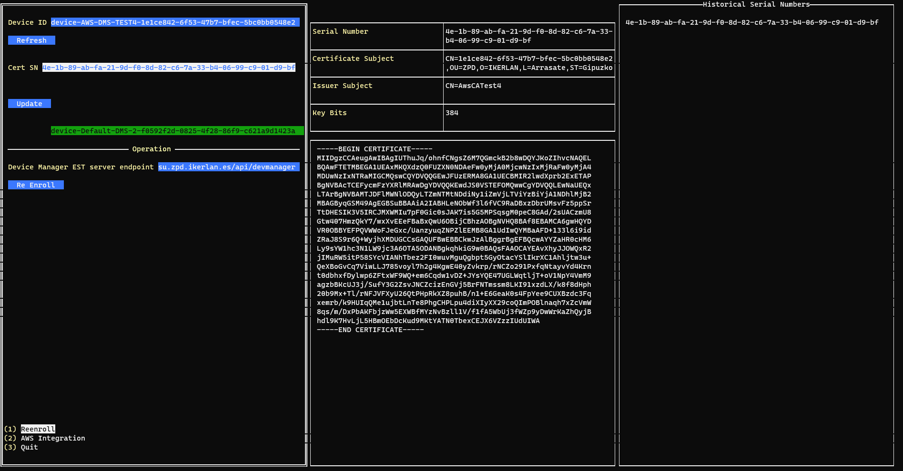

# Lamassu Virtual Device



It is recommended to follow this directory layout when deploying different Lamassu tools:
    ```
    $HOME/
         ├── lamassu-compose
         ├── lamassu-virtual-device
         └── lamassu-virtual-dms
    ```
Make sure to define the following variable with the absolute path

```
LAMASSU_COMPOSE_DIR=$HOME/lamassu-compose
LAMASSU_VDMS_DIR=$HOME/lamassu-virtual-dms
```

1. Clone the repository and get into the directory: 
    ```
    git clone https://github.com/lamassuiot/lamassu-virtual-device.git
    cd lamassu-virtual-device
    ```

2. Basic Virtual Device configuration:

    2.1 Specify the directory where enrolled device certificates (and keys) are stored:
        ```
        export VDEV_DEVICE_CERTIFICATES_DIR=$LAMASSU_VDMS_DIR/device-certificates
        ```
    2.2 Specify the URL pointing to the EST server:
        ```
        export VDEV_EST_SERVER_URL=dev.lamassu.io/api/devmanager
        ```
    2.3 Specify the public certificate used by the EST server:
        ```
        export VDEV_EST_SERVER_CERT=$LAMASSU_COMPOSE_DIR/tls-certificates/downstream/tls.crt
        ```

3. *Optional* - Configure the device to connect to AWS IoT core:
    3.1 Define the AWS IoT core endpoint to be used. Replace the `xxxxxx` with the appropriated value as well as the AWS Region to be used: 
        ```
        VDEV_AWS_IOT_CORE_ENDPOINT=xxxxxx-ats.iot.eu-west-1.amazonaws.com
        ```

4. Run the Virtual Device:
    ```
    ./run.sh
    ```