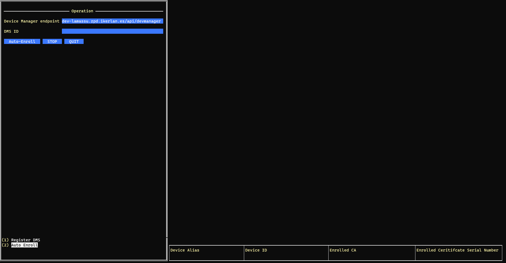

# Lamassu Virtual DMS



It is recommended to follow this directory layout when deploying different Lamassu tools:
    ```
    $HOME/
         ├── lamassu-compose
         ├── lamassu-virtual-device
         └── lamassu-virtual-dms
    ```
Make sure to define the following variable with the absolute path

```
LAMASSU_COMPOSE_DIR=$HOME/lamassu-compose
```

1. Clone the repository and get into the directory: 
    ```
    git clone https://github.com/lamassuiot/lamassu-virtual-dms.git 
    cd lamassu-virtual-dms
    ```

2. Basic Virtual DMS configuration:

    2.1 Locate the the public certificate used by the EST server:
    ```
    export VDMS_EST_SERVER_CERT=$LAMASSU_COMPOSE_DIR/tls-certificates/downstream/tls.crt
    ```

    2.2 Configure the domain used by lamassu:
    ```
    export VDMS_DOMAIN=dev.lamassu.io
    ``` 

    2.3 Provide the operator credentials to be used while creating a new DMS instance:
    ```
    export VDMS_USERNAME=enroller
    export VDMS_PASSWORD=enroller
    ``` 

    2.4 Specify the default values while creating a new DMS instance:
    ```
    export VDMS_COUNTRY=ES
    export VDMS_STATE=gipuzkoa
    export VDMS_LOCALITY=donostia
    export VDMS_ORGANIZATION=lamassu
    export VDMS_ORGANIZATION_UNIT=iot
    ```

3. Run the DMS application:
    ```
    run.sh
    ```